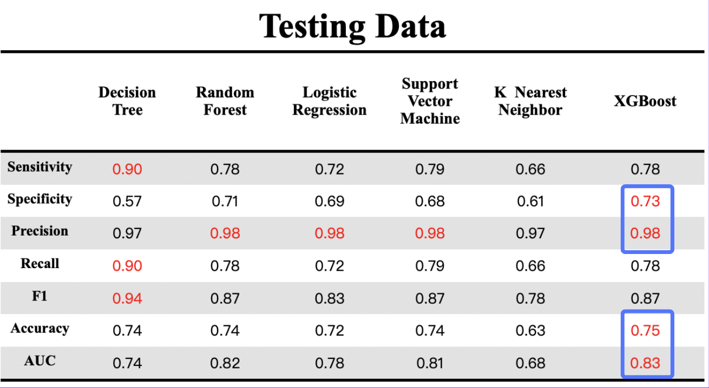

# [Group6] Prediction of Ecommerce Transaction Fraud（電子商務交易詐欺預測）
With the rapid advancement of electronic payments, the incidence of e-commerce fraud has escalated, leading to substantial financial losses for businesses and creating a negative experience for customers. Fraudsters employ various tactics, such as using stolen credit cards, taking over accounts, and engaging in friendly fraud. These activities result in financial chargebacks, disrupt operations, and damage the reputation of businesses. This growing issue poses a significant threat not only to individuals but also to financial institutions and the overall market stability.

Given the increasing prevalence and complexity of e-commerce fraud, our objective is to develop an advanced detection system. This project aims to build a fraudulent transaction detection system utilizing machine learning techniques. By analyzing customer data, transaction details, and historical patterns, we strive to identify suspicious activities with high accuracy, thereby mitigating the impact of fraud.

## Contributors
|組員|系級|學號|工作分配|
|-|-|-|-|
|蘇芷儀|經濟三|110208040|Introduction、EDA相關圖表| 
|賴威博|資科碩一|112753101|EDA相關圖表、Feature相關性分析、號召開會|
|藍璟誠|資管四|109306059|數據預處理、異常值替換、海報整理製作|
|劉育佑|資科碩二|111753145|Data Over/Undersampling、建立模型(Decision Tree、Random Forest、Logistic Regression)、特徵篩選(Features Selection)|
|趙駖翰|地政土管四|109207343|Data Over/Undersampling、建立模型(KNN、SVM、XGBoost)、特徵篩選(Features Selection)、交叉驗證&超參數調整(Grid Search)|

## Quick start
Please provide an example command or a few commands to reproduce your analysis, such as the following R script:
```R
Rscript code/xgboost_command.R
```

## Folder organization and its related description

### docs
* [Our presentation](docs/1122_DS-FP_group6.pdf), by **06.13**
* [PPT Online Link (Canva)](https://www.canva.com/design/DAGGaH_FEX4/opLypQZCkSWLLQa2rPEnHw/view?utm_content=DAGGaH_FEX4&utm_campaign=designshare&utm_medium=link&utm_source=editor), by **06.13**
* [Poster](docs/1122_DS-Poster_group6.pdf), by **06.02**
<p align="left">
 
<p/>

### data
* Input
  * Train Data : File 1 (檔案太大沒辦法上傳到 github): 
    * Source：[Kaggle](https://www.kaggle.com/datasets/shriyashjagtap/fraudulent-e-commerce-transactions?select=Fraudulent_E-Commerce_Transaction_Data.csv)
    * Format：CSV
    * Size：393 MB
  * Test Data : [File 2](data/Fraudulent_E-Commerce_Transaction_Data_2.csv)
    * Source : [Kaggle](https://www.kaggle.com/datasets/shriyashjagtap/fraudulent-e-commerce-transactions?select=Fraudulent_E-Commerce_Transaction_Data_2.csv)
    * Format : CSV
    * Size : 6.3 MB
  * Undersampling Train Data : [File 3](https://github.com/112-2-dataScience/finalproject-group6/blob/main/data/Fraudulent_E-Commerce_Transaction_Data_undersampling.csv)
    * Format : CSV
    * Size : 10.4 MB  

### features
| Variable               | Description |
|------------------------|-------------|
| **Transaction ID**     | A unique identifier for each transaction. |
| **Customer ID**        | A unique identifier for each customer. |
| **Transaction Amount** | The amount of the transaction in the local currency. |
| **Transaction Date**   | The date when the transaction took place. |
| **Payment Method**     | The method used for payment (e.g., credit card, PayPal, etc.). |
| **Product Category**   | The category of the purchased product. |
| **Quantity**           | The quantity of the purchased product. |
| **Customer Age**       | The age of the customer at the time of the transaction. |
| **Customer Location**  | The location (city, state, country) of the customer. |
| **Device Used**        | The device used for the transaction (e.g., smartphone, tablet). |
| **IP Address**         | The IP address from which the transaction was made. |
| **Shipping Address**   | The address to which the purchased product was shipped. |
| **Billing Address**    | The billing address associated with the payment method. |
| **Is Fraudulent**      | A binary indicator (0 or 1) indicating whether the transaction is fraudulent. |
| **Account Age Days**   | The number of days since the customer's account was created. |
| **Transaction Hour**   | The hour of the day when the transaction took place (24-hour format). |

### code
* Analysis steps
    * EDA &rarr; data cleaning & preprocessing &rarr; Model training with Raw data (and test with test data) &rarr; undersampling &rarr; Model training with processed data &rarr; feature selection &rarr;   grid search &rarr; Model Evaluation &rarr; Final Model Selection
* Which method or package do you use?
    * Data Processing : undersampling (package: ROSE)
    * Model we used :
      * Linear Regression
      * Dicision Tree
      * Random Forest
      * kNN
      * XGBoost
      * SVM
* How do you perform training and evaluation?
  * Given the original dataset provides two distinct files (one large and one small), we designated the larger file as the training dataset and the smaller file as the testing dataset. Consequently, we did not employ cross-validation or a train-test split approach. This method was chosen to leverage the pre-existing division of data for a straightforward and efficient evaluation process.
* What is a null model for comparison?
  * In the context of our classification problem, the null model serves as a reference point for evaluating the performance of more complex models. In our case, the null model predicts the class with the highest proportion in the entire dataset. Given that non-fraudulent transactions constitute 95% of the data, while fraudulent ones make up 5%, the null model simply predicts non-fraudulent for all instances. Consequently, the null model achieves an accuracy of approximately 0.95.
  * After undersampling, where both classes are balanced to represent 50% of the data, the null model's accuracy drops to around 0.5, as it would now randomly predict either class with equal probability.


### results
* What is your performance?
  * [Final Result（Google sheet link）](https://docs.google.com/spreadsheets/d/1NzNS6J4QpVot9OWKX1zGUxVTsgLjaOZDEASVQHR6S6E/edit?usp=sharing)
  * 
  * 
  * [Result PDF](results/DS_Final_result.pdf)
* Is the improvement significant?
  * After undersampling : Yes. After performing undersampling on the data, we observed a significant reduction in model training time due to the decreased data volume, which made the training process more efficient. Additionally, there was a notable improvement in the specificity metric, indicating a marked enhancement in the model's ability to accurately predict fraudulent cases. Specifically, the increase in specificity suggests that the model is better at minimizing false positives (i.e., incorrectly classifying legitimate transactions as fraudulent) while more accurately detecting actual fraudulent transactions. This improvement is crucial for effectively preventing fraud and ensuring transaction security.

  * Feature Selection : Yes. After performing feature selection, we discovered that training the model with the top two or three most relevant features achieves a balanced trade-off between accuracy and training time. Including additional features beyond this point resulted in only marginal improvements in accuracy, while significantly increasing the training time. This indicates that a more parsimonious model with fewer features not only maintains a high level of performance but also enhances computational efficiency.

## References
* This project uses the following R packages:
  - **[plotly](https://cran.r-project.org/web/packages/plotly/index.html)**: Create interactive, web-based plots via plotly's JavaScript graphing library.
  - **[kernlab](https://cran.r-project.org/web/packages/kernlab/index.html)**: Kernel-based machine learning methods for classification, regression, clustering, novelty detection, quantile regression, and dimensionality reduction.
  - **[ROCit](https://cran.r-project.org/web/packages/ROCit/index.html)**: An R package for performance assessment of scoring classifiers through ROC curves.
  - **[tidyverse](https://cran.r-project.org/web/packages/tidyverse/index.html)**: An opinionated collection of R packages designed for data science. All packages share an underlying design philosophy, grammar, and data structures.
  - **[magrittr](https://cran.r-project.org/web/packages/magrittr/index.html)**: Provides a mechanism for chaining commands with a new forward-pipe operator, %>%, and other handy operators.
  - **[tidymodels](https://cran.r-project.org/web/packages/tidymodels/index.html)**: A collection of packages for modeling and machine learning using tidyverse principles.
  - **[kknn](https://cran.r-project.org/web/packages/kknn/index.html)**: Weighted k-Nearest Neighbors for classification, regression, and clustering.
  - **[dplyr](https://cran.r-project.org/web/packages/dplyr/index.html)**: A grammar of data manipulation, providing a consistent set of verbs to help you solve the most common data manipulation challenges.
  - **[ggplot2](https://cran.r-project.org/web/packages/ggplot2/index.html)**: A system for 'declaratively' creating graphics, based on "The Grammar of Graphics".
  - **[caret](https://cran.r-project.org/web/packages/caret/index.html)**: Classification and regression training, a set of functions that attempt to streamline the process for creating predictive models.
  - **[patchwork](https://cran.r-project.org/web/packages/patchwork/index.html)**: Combines multiple ggplot2 diagrams for comparison and layout.
  - **[scales](https://cran.r-project.org/web/packages/scales/index.html)**: Provides extended control over axis scales and labels in ggplot2 diagrams.
  - **[xgboost](https://cran.r-project.org/web/packages/xgboost/index.html)**: Extreme Gradient Boosting, which is an efficient and scalable implementation of gradient boosting framework.
  - **[optparse](https://cran.r-project.org/web/packages/optparse/index.html)**: A command line option parser to be used with Rscript to write "#!" shebang scripts that accept short and long flag/options.
  - **[tidyr](https://cran.r-project.org/web/packages/tidyr/index.html)**: Tidy Messy Data, providing tools to help you clean your data.
  - **[readr](https://cran.r-project.org/web/packages/readr/index.html)**: Read Rectangular Text Data, making it easy to read many types of rectangular data including csv, tsv, and fwf.
  - **[purrr](https://cran.r-project.org/web/packages/purrr/index.html)**: Functional Programming Tools, enhancing R's functional programming toolkit by providing a complete and consistent set of tools for working with functions and vectors.
  - **[parallel](https://cran.r-project.org/web/views/HighPerformanceComputing.html)**: Support for parallel computation in R.
  - **[ggpubr](https://cran.r-project.org/web/packages/ggpubr/index.html)**: 'ggplot2' Based Publication Ready Plots.
  - **[pROC](https://cran.r-project.org/web/packages/pROC/index.html)**: Display and Analyze ROC Curves.
  - **[ROSE](https://cran.r-project.org/web/packages/ROSE/index.html)**: Provides functions to deal with binary classification problems in the presence of imbalanced classes.

* Related publications
  * Fraud Prediction : [Kaggle連結](https://www.kaggle.com/code/veerpatel6693/fraud-prediction)
  * SVM model : [more information](https://chih-sheng-huang821.medium.com/機器學習-kernel-函數-47c94095171)
  * XGBoost model : [more information](https://medium.com/jameslearningnote/資料分析-機器學習-第5-2講-kaggle機器學習競賽神器xgboost介紹-1c8f55cffcc)
  * KNN Model : [more information](https://medium.com/@jason8410271027/學習筆記-k近鄰演算法-理論-python實作-73c9bc9251c8)
  * Undersampling : [more information](https://ithelp.ithome.com.tw/articles/10294614)
